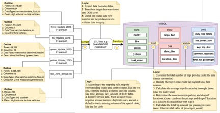
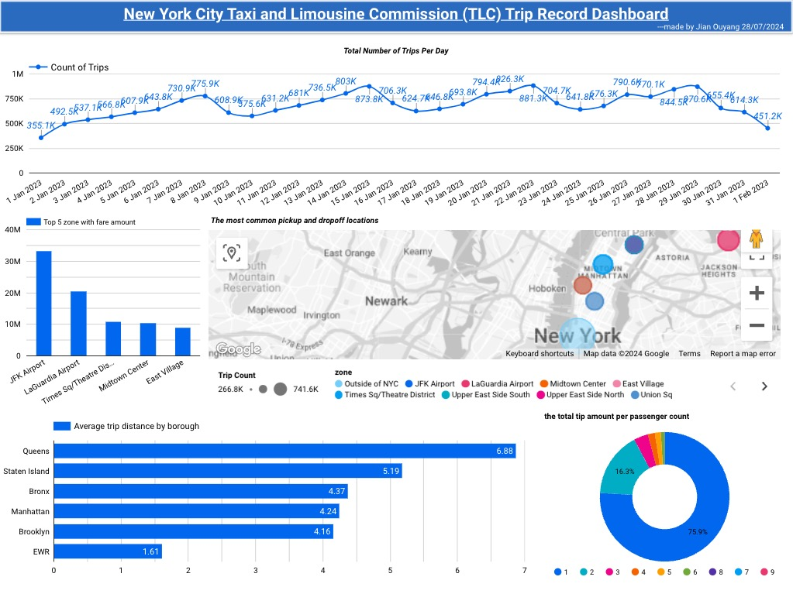

# Mini-Project
The project for testing development skill 
## Project Overview
The goal of this project is to demonstrate your ability to work with data from a public data source, transform it, and perform analysis using various SQL operations. You will create a simple data warehouse schema, perform ETL processes, and generate insights from the data.
## Prerequirite
pyodbc,pyspark,MSSQL,pandas,sqlalchemy and lookerstudio
## Code description
Run the following code in sequence
- extract_transform.py: this file is to extract data from file and transform to ODS layer
- load.py: using this file for loading data from ODS to DWD based on the mapping.xlsx and design document
- analysis.py: run this script to produce the data insight to DWS layer for providing data to BI tool. Such as lookerstudio
- DDL.sql
## Architecture

    

## Screenshot

    

